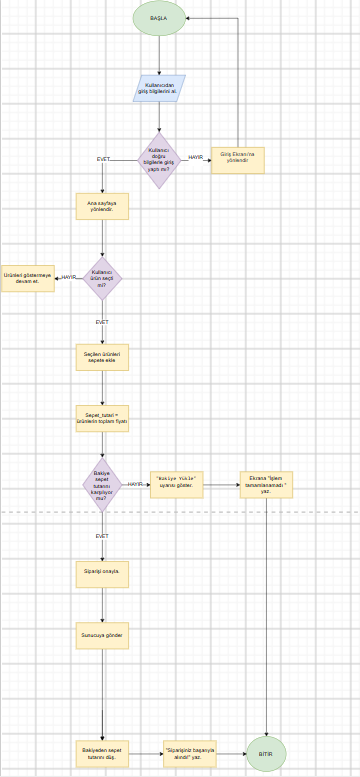

15.09.2026 17:02 Markdown Live Preview&nbsp;

Senaryo: "KahveGo" Mobil Kahve Sipariş Uygulaması&nbsp;

Bir kahve zinciri için geliştirilecek mobil sipariş uygulamasında kullanıcı:&nbsp;

1\. Uygulamayı açar, oturum durumu kontrol edilir.&nbsp;

2\. Ürünleri seçip sepete ekler ve siparişi onaylar.&nbsp;

3\. Arka planda sunucuya sipariş paketi gönderilir ve bakiye düşülür.&nbsp;

Sizden beklenen, bu senaryo üzerinden aşağıdaki 4 temel görevi tamamlamanızdır.&nbsp;

GÖREV 1: Mobil Akış Şeması (Flowchart) veya Sözde Kod (25 Puan)&nbsp;

Kullanıcının uygulamada kahve siparişi verme sürecini mantıksal adımlara dökün: Zorunlu Mantıksal Kontroller:&nbsp;

Kullanıcı giriş yapmış mı? (Giriş yapılmamışsa Giriş Ekranı'na yönlendir).&nbsp;

Kullanıcının cüzdan bakiyesi sepet tutarını karşılıyor mu? (Yetersizse "Bakiye Yükle" uyarısı ver, yeterliyse siparişi onayla ve bakiyeden düş).&nbsp;

Seçenek A (Görsel): draw.io, Excalidraw veya temiz bir kağıda çizilmiş akış şeması görseli (Başlangıç/Bitiş elipsi, Karar eşkenar dörtgeni, İşlem dikdörtgeni kurallarına uygun).&nbsp;

Seçenek B (Sözde Kod / Pseudocode): BAŞLA , EĞER ... İSE , DEĞİLSE , DÖNGÜ , BİTİR kalıplarını kullanarak sipariş akışının sözde kodunu yazın.&nbsp;

BAŞLA

Uygulamayı aç ve oturum durumunu kontrol et&nbsp;

EĞER Kullanıcı giriş yapmış İSE

Ana sayfaya yönlendir.

DEĞİLSE

Giriş ekranına yönlendir.

Kullanıcı giriş yaptıktan sonra ana sayfaya yönlendir.&nbsp;

&nbsp;&nbsp;EĞER SONU

DÖNGÜ

Ürünleri listele.

EĞER Kullanıcı ürün seçer İSE

Ürünleri sepete ekle.

DEĞİLSE&nbsp;&nbsp;

&nbsp;&nbsp;&nbsp;&nbsp;&nbsp;&nbsp;&nbsp;&nbsp;&nbsp;Ürünleri listelemeye devam et.

&nbsp;&nbsp;EĞER SONU

EĞER Kullanıcı alışverişi bitirip sepeti onaylarsa İSE  
DÖNGÜDEN ÇIK.  
DEĞİLSE  
Ürünleri listelemeye devam et.

DÖNGÜ SONU

Sepet Tutarı \= Ürünlerin Toplam Fiyatını Hesapla.

Cüzdan Bakiyesi \= Kullanıcı Bakiyesini Getir.

EĞER Cüzdan Bakiyesi \< Sepet Tutarı İSE

"Bakiye Yükle" uyarısı ver.

&nbsp;&nbsp;&nbsp;&nbsp;&nbsp;&nbsp;&nbsp;&nbsp;&nbsp;&nbsp;Ekrana “İşlem Tamamlanamadı.” yaz.

&nbsp;&nbsp;&nbsp;&nbsp;&nbsp;&nbsp;&nbsp;&nbsp;&nbsp;&nbsp;DEĞİLSE

&nbsp;&nbsp;&nbsp;&nbsp;&nbsp;&nbsp;&nbsp;&nbsp;&nbsp;&nbsp;Siparişi onayla.

&nbsp;&nbsp;&nbsp;&nbsp;&nbsp;&nbsp;&nbsp;&nbsp;&nbsp;&nbsp;Sunucuya sipariş paketini gönder.

&nbsp;&nbsp;&nbsp;&nbsp;&nbsp;&nbsp;&nbsp;&nbsp;&nbsp;Cüzdan Bakiyesinden sepet tutarını düş.&nbsp;&nbsp;&nbsp;&nbsp;&nbsp;&nbsp;&nbsp;&nbsp;&nbsp;

&nbsp;&nbsp;&nbsp;&nbsp;&nbsp;&nbsp;&nbsp;&nbsp;&nbsp;"Siparişiniz başarıyla alındı\!" yaz.&nbsp;&nbsp;&nbsp;&nbsp;&nbsp;

&nbsp;&nbsp;&nbsp;&nbsp;&nbsp;&nbsp;EĞER SONU

&nbsp;&nbsp;&nbsp;&nbsp;BİTİR

&nbsp;

&nbsp;

&nbsp;

&nbsp;

&nbsp;

&nbsp;

&nbsp;

GÖREV 2: REST API Uç Noktası (Endpoint) & JSON Tasarımı (25 Puan)&nbsp;

Derste işlediğimiz HTTP metotları, Header'lar, JSON paketleri ve durum kodlarını kullanarak aşağıdaki 2 endpoint'i tasarlayın:&nbsp;

1\. Sipariş Oluşturma Endpoint'i:&nbsp;

HTTP Metodu: POST&nbsp;

URL / Endpoint: /api/v1/siparisler&nbsp;

Header: Authorization: Bearer \<token\> , Content-Type: application/json&nbsp;

Örnek Request Body (JSON): (Örn: kahve adı, boyutu, adedi ve toplam tutar).&nbsp;

Başarılı Sonuç HTTP Durum Kodu: (Örn: 201 Created)&nbsp;

Kullanıcı Giriş Yapmamışsa Dönecek HTTP Durum Kodu: (Örn: 401 Unauthorized)&nbsp;

## **`text`**

`POST /api/v1/siparisler HTTP/1.1`

`Host: api.ornek.com`

`Authorization: Bearer <token>`

`Content-Type: application/json`

## **`Request Body(json)`**

`{`

&nbsp;&nbsp;`"urun_adi": "Türk Kahvesi",`

&nbsp;&nbsp;`"boyut": "Orta",`

&nbsp;&nbsp;`"adet": 2,`

&nbsp;&nbsp;`"birim_fiyat": 175.00,`

&nbsp;&nbsp;`"toplam_tutar": 350.00,`

&nbsp;&nbsp;`"para_birimi": "TRY"`

`}`

## `Başarılı Yanıt`

HTTP Durum Kodu: 201 Created

**`text`**

`HTTP/1.1 201 Created`

`Content-Type: application/json`

**`json`**

`{`

&nbsp;&nbsp;`"mesaj": "Sipariş başarıyla oluşturuldu.",`

&nbsp;&nbsp;`"siparis_id": 1025,`

&nbsp;&nbsp;`"durum": "Hazırlanıyor",`

&nbsp;&nbsp;`"toplam_tutar": 350.00,`

&nbsp;&nbsp;`"para_birimi": "TRY"`

`}`

## Kullanıcı Giriş Yapmamışsa

HTTP Durum Kodu: `401 Unauthorized`

**text**

`HTTP/1.1 401 Unauthorized`

`Content-Type: application/json`

**json**

`{`

&nbsp;&nbsp;`"hata": "Yetkisiz erişim.",`

&nbsp;&nbsp;`"mesaj": "Sipariş oluşturmak için giriş yapmanız gerekmektedir."`

`}`

&nbsp;

2\. Cüzdan Bakiye Sorgulama Endpoint'i:&nbsp;

HTTP Metodu: GET&nbsp;

URL / Endpoint: /api/v1/kullanici/bakiye&nbsp;

Örnek Response (JSON): (Örn: {"bakiye": 185.50, "para\_birimi": "TRY"} )&nbsp;

Sunucuda Beklenmeyen Hata Çıkarsa Dönecek Durum Kodu: (Örn: 500 Internal Server Error)&nbsp;

**text**

&nbsp;&nbsp;&nbsp;&nbsp;&nbsp;&nbsp;&nbsp;`GET  /api/v1/kullanici/bakiye HTTP/1.1`

&nbsp;&nbsp;&nbsp;&nbsp;`Host: api.ornek.com`

&nbsp;&nbsp;&nbsp;&nbsp;`Authorization: Bearer <token>`

&nbsp;&nbsp;&nbsp;&nbsp;`Content-Type: application/json`

&nbsp;

&nbsp;

&nbsp;

HTTP Durum Kodu: 200 OK

text

`HTTP/1.1 200 OK`

`Content-Type: application/json`

json

`{`

&nbsp;&nbsp;`"bakiye": 185.50,`

&nbsp;&nbsp;`"para_birimi": "TRY"`

`}`

## Sunucuda Beklenmeyen Hata Olursa

HTTP Durum Kodu: 500 Internal Server Error

text

`HTTP/1.1 500 Internal Server Error`

`Content-Type: application/json`

json

`{`

&nbsp;&nbsp;`"hata": "Sunucu hatası.",`

&nbsp;&nbsp;`"mesaj": "Bakiye bilgisi alınırken beklenmeyen bir hata oluştu."`

&nbsp;

Mini Mülakat Sorusu (1 Cümleyle Açıklayın):&nbsp;

Yukarıdaki GET ve POST isteklerinden hangisi Idempotent (Eşgüçlü) bir istektir, hangisi değildir? Neden? GET idempotenttir çünkü aynı GET isteği tekrarlandığında sunucudaki veri değişmez; POST ise idempotent değildir çünkü aynı istek tekrarlandığında birden fazla sipariş oluşturulabilir.&nbsp;

GÖREV 3: Clean Code & SOLID Prensip Teşhisi (25 Puan)&nbsp;

Aşağıda junior bir geliştirici tarafından yazılmış temsili bir sipariş sınıfı yer almaktadır:&nbsp;

https://markdownlivepreview.com 1/2

15.09.2026 17:02 Markdown Live Preview&nbsp;

class KahveSiparisYoneticisi {&nbsp;

void sepetHesaplaVeIndirimUygula() { ... }&nbsp;

void krediKartindanTahsilatYap() { ... }&nbsp;

void siparisiVeritabaninaKaydet() { ... }&nbsp;

void musteriyiSmsIleBilgilendir() { ... }&nbsp;

double indirimHesapla(String musteriTipi, double tutar) {&nbsp;

if (musteriTipi \== "OGRENCI") return tutar \* 0.80;&nbsp;

else if (musteriTipi \== "OGRETMEN") return tutar \* 0.85;&nbsp;

else return tutar;&nbsp;

}&nbsp;

}&nbsp;

Soru:&nbsp;

1\. Bu sınıfta Single Responsibility Principle (SRP \- Tek Sorumluluk) nasıl ihlal edilmiştir? Sınıfı hangi küçük parçalara bölmeliyiz? (Kod yazmanıza gerek yoktur, 2 cümleyle açıklayın).&nbsp;

&nbsp;KahveSiparisYoneticisi sınıfı sepet hesaplama, ödeme alma, veritabanına kayıt ve SMS gönderme gibi birden fazla sorumluluğu aynı anda üstlendiği için SRP'yi ihlal etmektedir. Bu sınıfı SepetHesaplayici, OdemeYoneticisi, SiparisRepository ve BildirimYoneticisi gibi küçük sınıflara bölmeliyiz.&nbsp;

2\. indirimHesapla fonksiyonunda yarın yeni bir müşteri tipi (örneğin "DOKTOR" ) geldiğinde if-else kodunu değiştirmek zorunda kalmak hangi SOLID prensibine aykırıdır? (Open/Closed Principle \- OCP).&nbsp;

&nbsp;&nbsp;&nbsp;&nbsp;Yeni bir müşteri tipi geldiğinde mevcut `if-else` yapısını değiştirmek zorunda kalmak Open/Closed Principle (OCP) prensibine aykırıdır. Yeni müşteri tipi geldiğinde mevcut sınıfları değiştirmeden yeni bir `Indirim` sınıfı eklenirse(intarface ile) OCP'ye uygun olur.&nbsp;&nbsp;

GÖREV 4: Git, Branching & GitHub Release Pratiği (25 Puan)&nbsp;

Tüm ödev yanıtlarınızı tek bir ODEV.md dosyasında toplayıp aşağıdaki Git adımlarını uygulayın:&nbsp;

1\. Kendi GitHub reponuzda feature/kahvego-tasarim isimli yeni bir branch açın.&nbsp;

2\. Hazırladığınız ODEV.md dosyasını (varsa akış şeması görselini de ekleyerek) repoya ekleyin.&nbsp;

3\. Conventional Commits standardına uygun bir commit atın:&nbsp;

git commit \-m "feat: kahvego akis semasi, rest api ve solid analizi"&nbsp;

4\. Bu branch'i GitHub'a gönderip main dalına doğru bir Pull Request (PR) açın.&nbsp;

5\. PR açıklamasını yazıp PR'ı kendiniz main dalına merge edin.&nbsp;

6\. main dalı üzerinde v1.2.0 etiketi oluşturarak GitHub üzerinde bir Release (Sürüm) yayınlayın: Başlık: Release v1.2.0 \- KahveGo Mimari ve API Tasarımı&nbsp;

7\. Oluşturduğunuz GitHub Release linkini SoftITO LMS sistemine ödev yanıtı olarak teslim edin.&nbsp;

https://markdownlivepreview.com 2/2